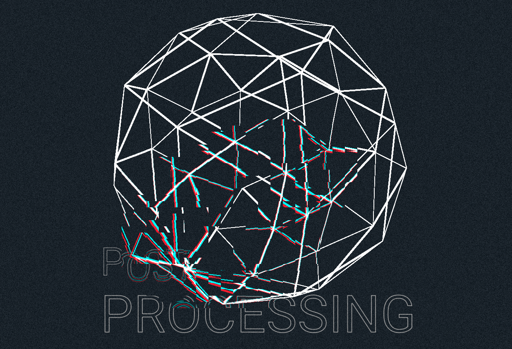

Implementing custom post-processing effects in React Three Fiber. See it live here: https://elegant-dango-96218c.netlify.app/

Inspired by: https://www.youtube.com/watch?v=LCtH6lX4AA4&ab_channel=YuriArtiukh and https://www.youtube.com/watch?v=dyvhB6UVxwE&ab_channel=YuriArtiukh

